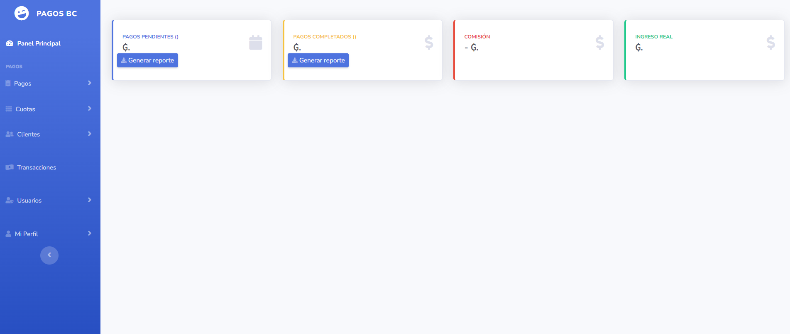
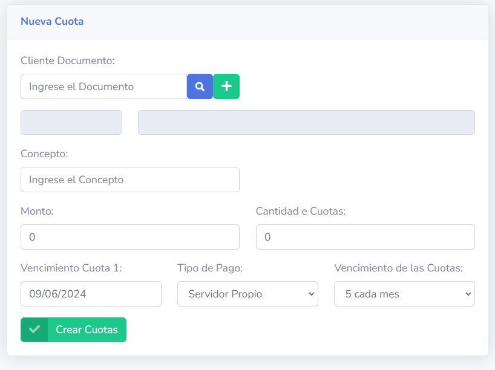
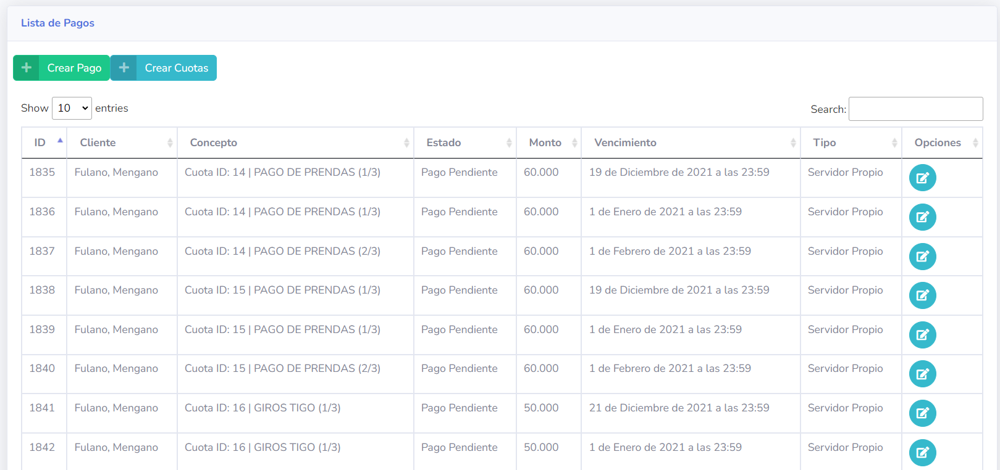

# Sistema de Conexión a Servicios de Pago en Paraguay

Este proyecto es un sistema para conectarse a los servicios de pago de boca de cobranza de Paraguay: Pagopar, Aquipago y Pago Express. 
Permite generar pagos o listas de cuotas que los clientes pueden pagar en dichos locales. El sistema está desarrollado en Python utilizando el framework Django y es de código libre.

## Imágenes de Ejemplo

Aquí puedes agregar imágenes de ejemplo que ilustren cómo se ve el sistema y cómo funciona. Asegúrate de colocar las imágenes en un directorio accesible, por ejemplo, en `images` dentro del repositorio.

### Pantalla de Inicio

### Generar Pago

### Lista de Cuotas/Pagos

## Licencia

Este proyecto está bajo la Licencia MIT. Consulta el archivo [LICENSE](LICENSE) para más detalles.

